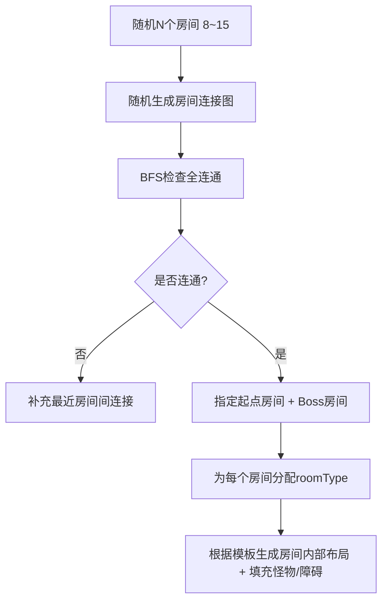

# Isaac 房间/怪物/掉落 — 扩充设计方案

> 基于 `isaac-turnbased-demo.html` 当前 13×7 单房间框架，扩充为 Roguelike 多房间地图系统。

---

## 1. 地图生成方案

### 1.1 数据结构（三层）

```
Floor（楼层）
  ├── rooms: Room[]           ← 本层所有房间
  ├── connections: Edge[]      ← 房间之间的门连接
  └── currentRoomId            ← 玩家当前所在房间

Room（单房间）
  ├── id, roomType             ← 房间类型
  ├── grid[13][7]              ← 每个格子类型
  ├── doors: { up, down, left, right }
  ├── monsters[]               ← 该房间专属怪物
  └── cleared: bool            ← 是否已清空
```

### 1.2 网格类型定义（✅ 已实现）

```javascript
const TILE = {
  FLOOR: 0,           // 普通地面 — 可行走，不阻挡弹道
  ROCK:  1,           // 岩石 — 不可行走，阻挡子弹，可被爆炸摧毁（5%掉落）
  POOP:  2,           // 便便 — 不可行走，阻挡子弹，耐久4（被击中4次摧毁，5%掉落）
  PIT:   3,           // 深坑 — 不可行走，不阻挡弹道，不可摧毁，相邻合并
  SPIKE: 4,           // 尖刺地面 — 可行走，不阻挡弹道，经过-2HP(玩家)/-5HP(怪物)
};

// 每个 TILE 的行为属性
const TILE_PROPS = {
  [TILE.FLOOR]: { walkable: true,  blocksBullet: false },
  [TILE.ROCK]:  { walkable: false, blocksBullet: true  },
  [TILE.POOP]:  { walkable: false, blocksBullet: true  },
  [TILE.PIT]:   { walkable: false, blocksBullet: false },
  [TILE.SPIKE]: { walkable: true,  blocksBullet: false },
};
```

### 1.2.1 门系统（✅ 已确定）

- 房间为四方形，每边正中一个门，**不占用格子**（是墙壁上的特殊段）
- 关闭时和普通墙壁一样阻挡移动，打开时玩家走到门前格 → 切换房间
- 门前格唯一位置：
  - 上门: (col=6, row=0)    下门: (col=6, row=6)
  - 左门: (col=0, row=3)    右门: (col=12, row=3)
- 门不由模板定义，由楼层生成算法根据房间连接图自动放置

### 1.3 isWall() 改造

当前 `isWall()` 只检查坐标越界。扩充后需改为同时检查两种条件：

1. 坐标越界 → 不可行走
2. `grid[col][row] === TILE.ROCK` → 不可行走

DOOR 类型在玩家位于相邻格时触发房间切换。

### 1.4 楼层生成算法（随机图生成）

本方案采用"以撒模式"——每个房间是独立的 13×7 空间，玩家通过门口的镜头平移来切换房间，房间之间不存在物理走廊。因此无需 BSP 切分有限矩形区域，只需随机生成房间连接图即可。



**说明：**
- 房间数量在 8~15 之间纯随机决定，无需切分地板区域。
- 连接图为无向图，边代表"门"连接，图生成时可通过控制每个节点的度数来确保布局合理。
- BFS 全连通检查保证从起点能到达所有房间。
- **房间必须紧挨**：连接的房间之间距离必须为 1（Manhattan 距离），不能跨空白格。布局采用随机顺序重试机制（最多 30 次），确保所有边相邻。同时渲染也兜底 L 形线，绝不出斜线。
- **门一致性校验**：门分配时检测冲突（同一方向覆盖旧门），分配后验证每个房间的门数必须等于边数，不符时输出 ⚠ 警告。
- Boss 房间强制约束：**度数必须 = 1**（严格单门），图生成阶段保证至少 3 个叶节点（start + Boss + 宝箱各一）。
- **宝箱房间强制约束**：和 Boss 房一致，**度数必须 = 1**（严格单门死路），确保宝箱房是真正的"探索终点奖励房间"。

### 1.5 房间类型分配

| 类型 | 数量 | 特征 |
|------|------|------|
| `start` | 1 | 无怪，无门（等玩家进入后生成入口门） |
| `normal` | 4~8 | 1~3只怪物，有随机障碍物 |
| `treasure` | 1~2 | 无怪，有可拾取道具，**强制单门（度数=1）** |
| `shop` | 0~1 | 未来扩展 |
| `boss` | 1 | 1只Boss怪，**强制单门（度数=1）** |

### 1.6 房间内部布局（✅ 已实现 12 种模板）

当前已设计 12 种房间模板，每模板为 13×7 字符数组，使用 `.` `#` `P` `O` `^` 分别表示 5 种 TILE 类型。

| # | 模板 Key | 名称 | 特殊格 | 适用房间类型 |
|:--:|------|------|:--:|------|
| 1 | `open` | 空旷大厅 | - | start/normal/treasure/shop |
| 2 | `cross_rocks` | 十字岩石 | - | normal/treasure |
| 3 | `four_corners` | 四角岩石 | - | normal/treasure |
| 4 | `pillars` | 四柱大厅 | P×2 | normal/treasure |
| 5 | `corridor` | 横向窄道 | - | normal |
| 6 | `corridor_v` | 纵向窄道 | - | normal |
| 7 | `scattered` | 散落岩石 | - | normal |
| 8 | `ring` | 环形壁垒 | - | normal/treasure |
| 9 | `room_split` | 裂半之室 | ^×4 | normal |
| 10 | `alcoves` | 壁龛石室 | P×2 | normal/treasure |
| 11 | `diagonal` | 斜岩通道 | - | normal |
| 12 | `boss_arena` | Boss竞技场 | - | boss |

关键设计规则：
- 4 个门前格(6,0)(6,6)(0,3)(12,3) 必须 walkable（FLOOR 或 SPIKE）
- 所有门位之间必须在曼哈顿 4 方向移动下 BFS 全连通（无需炸弹破坏岩石即可互达）
- 全部 12 个模板已通过自动化连通性验证

### 1.7 房间模板编辑器（✅ 已实现）

工具文件: `isaac-map-viewer.html`（独立运行，不依赖 `isaac-turnbased-demo.html`）

功能：
- **模板池管理**: 查看全部模板缩略图，编辑/复制/删除，自动连通性验证
- **13×7 画布编辑器**: 调色板选 5 种 TILE，拖拽绘制，撤销/清空
- **自动生成**: 6 种 Isaac 风格设计图案（角岩/十字/石墙/石柱/斜线/中柱），随机组合 + 连通性验证
- **关卡池持久化**: 
  - `isaac-room-pool.json` 为关卡池数据文件
  - 启动时自动加载（File System Access API 或文件选择器回退）
  - 编辑后一键同步写回 JSON 文件
  - 支持跨设备迁移（带上 `pool.json` 即可）
- **楼层生成预览**: 第二标签页，随机生成 6 层地牢布局预览

### 1.8 控制地图方式的汇总

| 控制维度 | 控制方式 |
|----------|---------|
| 布局变化 | 修改 `ROOM_TEMPLATES` 中的模板 |
| 类型出现频率 | 修改 `ROOM_TYPE_WEIGHTS` |
| 怪物数量/类型 | 修改模板中 `monsterSlots` / `obstacleSlots` |
| 房间总数 | 修改随机范围 `[8, 15]` |
| 房间连接数 | 修改 `maxExtra`（额外边比例） |
| 房间最大门数 | 硬限制 ≤ 4（每方向一扇，杜绝一门多连） |
| Boss 位置 | 自动选距离起点最远且度数=1 的节点（强制单门） |
| 宝箱房位置 | 自动选度数=1 的节点（与 Boss 相同，强制单门） |

### 1.8 房间切换

玩家走到门口边缘 → 触发过渡：

1. 保存当前房间怪物状态（切换回时恢复）
2. 切换到新房间，加载/生成该房间内容
3. 玩家出现在对应门口位置

---

## 2. 怪物配置表方案

### 2.1 推荐方案：内联 JS 配置对象

考虑到单文件 HTML 架构，内联配置对象比 CSV/JSON 外部加载更简单可靠：

```javascript
const MONSTER_DB = {
  // ===== 普通怪物 =====
  'crack_maw': {
    id: 'crack_maw',
    name: '裂口尸',
    hp: 10,
    moveCycle: [2, 1],        // 双回合交替移速
    damage: 1,                // 碰撞伤害
    aiType: 'chase',          // AI行为类型
    sprite: 'monster_default',
    tint: null,               // 颜色叠加
    dropTable: 'common',      // 掉落表引用
    dropRate: 0.4,            // 掉落概率
    roomTypes: ['normal'],    // 可出现的房间类型
  },

  'flying_eye': {
    id: 'flying_eye',
    name: '浮游眼',
    hp: 6,
    moveCycle: [1, 1],
    damage: 1,
    aiType: 'ranged_kite',    // 远程风筝AI
    aiRange: 3,               // AI攻击距离
    sprite: 'monster_eye',
    tint: 'rgba(180,180,255,0.25)',
    dropTable: 'ranged',
    dropRate: 0.5,
    roomTypes: ['normal'],
  },

  'rock_golem': {
    id: 'rock_golem',
    name: '岩石魔像',
    hp: 20,
    moveCycle: [1, 1],        // 只走1格
    damage: 2,                // 高伤害
    aiType: 'chase',
    sprite: 'monster_golem',
    tint: 'rgba(180,160,140,0.4)',
    dropTable: 'heavy',
    dropRate: 0.7,
    roomTypes: ['normal', 'treasure'],
  },

  // ===== Boss 怪物 =====
  'boss_maw_king': {
    id: 'boss_maw_king',
    name: '裂口之王',
    hp: 45,
    moveCycle: [3, 2],
    damage: 2,
    aiType: 'boss_chase',
    sprite: 'monster_boss',
    tint: 'rgba(255,100,50,0.4)',
    dropTable: 'boss',
    dropRate: 1.0,             // Boss必掉
    roomTypes: ['boss'],
  },
};
```

### 2.2 AI 行为类型枚举

| aiType | 行为描述 |
|--------|---------|
| `chase` | 向玩家移动，方向优先差值大的轴（当前实现） |
| `ranged_kite` | 与玩家保持 2~3 格距离，每回合远程射击 |
| `patrol` | 沿预设路径来回移动，玩家靠近才追击 |
| `charge` | 每 3 回合向玩家冲刺 3~4 格 |
| `stationary` | 不移动，但每回合向玩家远程射击 |
| `boss_chase` | chase 增强版：移动 + 偶尔召唤小怪/特殊攻击 |

### 2.3 配置扩展方式

未来新增怪物只需在 `MONSTER_DB` 中添加一条记录，无需修改游戏逻辑代码。新增 AI 类型则需在 `executeMonsterAI()` 中增加一个 case 分支。

---

## 3. 奖励和掉落配置方案

### 3.1 道具定义

```javascript
const ITEMS = {
  // --- 消耗品 ---
  'half_heart':  { type:'consumable', name:'半颗心',   icon:'❤',   onPickup(p){ p.hp=Math.min(p.maxHp,p.hp+0.5); } },
  'full_heart':  { type:'consumable', name:'整颗心',   icon:'❤❤', onPickup(p){ p.hp=Math.min(p.maxHp,p.hp+1); } },
  'bomb':        { type:'consumable', name:'炸弹',     icon:'💣', count:1 },

  // --- 货币 ---
  'coin':        { type:'currency', name:'金币', value:1 },
  'key':         { type:'currency', name:'钥匙', value:1 },

  // --- 被动能力提升 (永久) ---
  'damage_up':   { type:'passive', name:'力量提升', icon:'⚔',  onPickup(p){ p.attack  += 1.0; } },
  'range_up':    { type:'passive', name:'射程提升', icon:'🎯', onPickup(p){ p.range   += 1;   } },
  'speed_up':    { type:'passive', name:'移速提升', icon:'👟', onPickup(p){ p.moveSpeed += 0.5; } },
  'fire_up':     { type:'passive', name:'射速提升', icon:'🔥', onPickup(p){ p.fireRate += 1;   } },
  'max_hp_up':   { type:'passive', name:'生命上限+1',icon:'❤+', onPickup(p){ p.maxHp+=1; p.hp+=1; } },
};
```

### 3.2 掉落表（权重随机）

```javascript
const DROP_TABLES = {
  'common': [
    { item:'coin',       weight:50, count:[1,3] },
    { item:'half_heart', weight:20 },
    { item:'bomb',       weight:10 },
    { item:'key',        weight:5  },
    { item:'nothing',    weight:15 },   // 不掉落
  ],
  'ranged': [
    { item:'coin',       weight:40, count:[2,5] },
    { item:'half_heart', weight:25 },
    { item:'damage_up',  weight:5  },
    { item:'range_up',   weight:3  },
    { item:'nothing',    weight:27 },
  ],
  'heavy': [
    { item:'coin',       weight:30, count:[3,6] },
    { item:'full_heart', weight:20 },
    { item:'max_hp_up',  weight:5  },
    { item:'speed_up',   weight:5  },
    { item:'nothing',    weight:40 },
  ],
  'boss': [
    { item:'full_heart',  weight:100, count:[1,2]  },
    { item:'damage_up',   weight:80  },
    { item:'max_hp_up',   weight:60  },
    { item:'fire_up',     weight:60  },
    { item:'boss_trophy', weight:100 },   // 通关凭证 → 下一层
    { item:'coin',        weight:30, count:[8,15] },
  ],
  'poop': [
    { item:'coin',       weight:50, count:[1,2] },
    { item:'half_heart', weight:15 },
    { item:'nothing',    weight:35 },
  ],
};
```

### 3.3 掉落执行逻辑

```javascript
function rollDrop(tableKey) {
  const table = DROP_TABLES[tableKey];
  const totalW = table.reduce((s, e) => s + e.weight, 0);
  let roll = Math.random() * totalW;
  for (const entry of table) {
    roll -= entry.weight;
    if (roll <= 0) {
      if (entry.item === 'nothing') return null;
      const count = entry.count
        ? entry.count[0] + Math.floor(Math.random() * (entry.count[1] - entry.count[0] + 1))
        : 1;
      return { item: entry.item, count };
    }
  }
  return null;
}
```

### 3.4 能力提升系统

被动能力提升采用**永久修改 `playerStats` 对象**的方式：

```javascript
function applyPassive(itemId) {
  const item = ITEMS[itemId];
  if (item.type !== 'passive') return;
  item.onPickup(playerStats);
  // 触发的副作用：M-AP/A-AP上限自动重新计算
}

// 属性展示更新（UI底部自动变化）
// 移速 3 → 3.5 → 4: M-AP 从 3→3→4 (系数1, 下限1)
// 射速 3 → 4 → 5: A-AP 从 3→4→5 (系数1, 下限1)
```

---

## 实施优先级

| 优先级 | 内容 | 预计工作量 | 依赖 |
|--------|------|-----------|------|
| P0 | 房间网格系统 + `TILE` 枚举 + 障碍物渲染 | 中 | 无 |
| P0 | 怪物配置表 `MONSTER_DB` + AI类型枚举 | 中 | 无 |
| P1 | 楼层生成（随机图 + 房间模板） | 大 | P0 |
| P1 | 房间切换（门过渡） | 中 | P0 |
| P2 | 掉落系统 + 道具拾取 | 中 | P0, P1 |
| P2 | Boss房间 + 通关层切换 | 中 | P1 |
| P3 | 障碍物摧毁（大便） | 小 | P0 |
| P3 | 多种AI行为实现 | 中 | P0 |

—

建议从 **P0：房间网格系统** 开始，先把 `isWall` 从纯越界检查扩展到支持内部障碍物，再逐步铺开地图生成。
