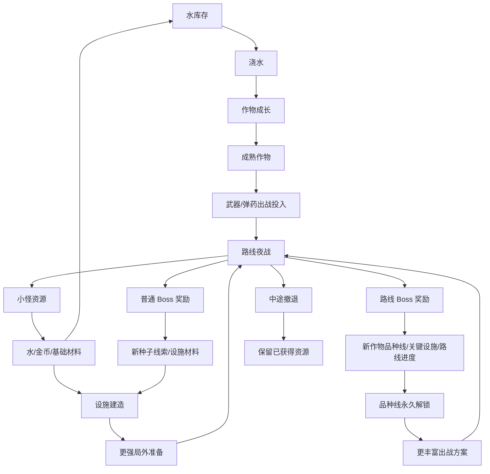
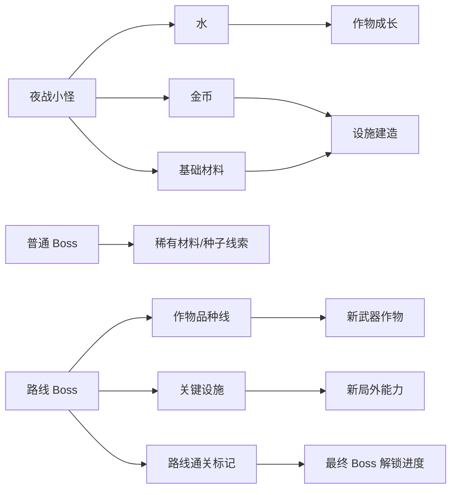

# 顶层设计：刃种农庄

## 顶层定位

《刃种农庄》是一款黑色幽默武器作物 roguelite。玩家以“一天”为基本循环：白天经营一段不长不短的农场局外段，在有限田地里种种子、浇水、收获、升级设施；夜晚带着农田产出的消耗性武器或弹药进入较长路线夜战。夜战可以中途撤退，撤退或结束后进入日结，推进下一天，让作物成熟、设施完成、资源回流，并逐步解锁新的武器作物品种线。

顶层目标不是做长线农场生活，也不是做纯幸存者战斗，而是让玩家每天都在想：

> 今天这些田地和资源怎么投，今晚能走多远，回来能不能养出更离谱的武器作物？

## 规模锚点

| 项 | 定义 |
|---|---|
| 循环单位 | 一天 |
| 局外段 | 不长不短的农场经营段：种植、浇水、收获、设施升级、出战准备 |
| 夜战段 | 可持续二三十分钟的路线推进战斗，可中途撤退 |
| 操作复杂度 | 低输入单摇杆状态，借鉴 Vampire Survivors / Brotato 的轻操作，不做重动作连招 |
| 经营复杂度 | 短局局外经济，借鉴 DAVE THE DIVER / Mewgenics 的行动后回收和跨天推进，不做 Stardew / 开罗式长线经营 |
| 长期目标 | MVP 先验证一条线性路线；长线扩展为多条路线各有路线 Boss，击败所有路线 Boss 后解锁最终 Boss |
| 长期期待 | 优先解锁武器作物品种线，其次解锁农田设施，再其次才是角色数值 |

## 核心循环图

## 完整循环图

## 资源流图

## 一天流程

| 阶段 | 玩家行为 | 设计目的 |
|---|---|---|
| 早晨 | 查看现有田地、成熟进度、设施建造、当前水量 | 给当天局外决策提供状态 |
| 白天 | 给关键作物浇水，选择新种子，收获成熟作物，决定设施升级 | 在有限田地和资源里做投资 |
| 黄昏 | 选择要带进夜战的武器作物或弹药 | 把农场产出转成夜战投入 |
| 夜晚 | 推进某条路线，击败小怪、普通 Boss 或路线 Boss；可中途撤退 | 赚取水、金币、材料和关键成长 |
| 日结 | 结算获得资源、带出战耐久消耗、作物成长、设施完成、路线进度 | 解释回流并推进下一天 |

## 白天农场段

白天不是长线生活模拟，而是局外投资段。

玩家主要做三类决策：

1. **有限田地种什么。** 不同种子占地、成熟天数、收获方式和夜战用途不同。
2. **水分配给谁。** 水整体较充足，但不是无限；未浇水的作物停止成长，不轻易枯萎。
3. **金币和材料投给哪些设施。** 设施影响农田效率、作物保存、品种线解锁和夜战准备。

作物可以有两类收获节奏：

| 作物类型 | 顶层作用 |
|---|---|
| 一次性收获作物 | 收获后变成武器/弹药，带出战即消耗耐久或次数 |
| 多轮收获作物 | 成熟后可多次产出弹药、补给或低强度武器资源 |

具体作物名称、成熟天数和数值不在 Top Design 阶段定。

## 夜战段

夜战是路线推进，不是 3-5 分钟短局。它可以持续二三十分钟，但玩家可以中途撤退。

夜战的顶层规则：

- 不能主动选择难度。
- 难度来自路线深度、敌人组合、普通 Boss、路线 Boss 和长期解锁进度。
- 小怪主要掉水、金币和基础材料。
- 普通 Boss 掉更好的材料、种子线索或设施材料。
- 路线 Boss 掉更关键的成长内容，例如新作物品种线、关键设施和路线通关标记。
- MVP 先用一条线性路线承载小怪、普通 Boss 和路线 Boss。
- 击败所有路线 Boss 后解锁最终 Boss是长线结构，不是 MVP 前提。

撤退不是失败，而是风险控制。玩家可以在觉得“已经回本”时撤退，把已获得资源带回农场并进入日结。

## 失败与回收

本项目不做硬核亏损。打得不好主要是少拿奖励，而不是强惩罚。

| 情况 | 结果 |
|---|---|
| 提早撤退 | 保留已获得的小怪资源和部分推进收益 |
| 打得浅 | 水、金币和材料较少，可能无法满足全部田地成长或设施建设 |
| 没打到 Boss | 拿不到关键成长内容 |
| 带出战作物 | 无论打得好坏，都消耗一次耐久或新鲜度 |
| 水不足 | 未浇水作物停止生长，不轻易枯萎 |

这种设计让玩家有回本感，但不因一次失败而强烈挫败。

## 长期结构

长期目标是：

1. 通过每天的农场投资和夜战回流，解锁更多武器作物品种线和农田设施。
2. 先用这些局外成长逐步推进一条线性路线。
3. MVP 成立后扩展为多条夜战路线，并击败每条路线末尾的路线 Boss。
4. 击败所有路线 Boss 后，解锁最终 Boss。

武器作物品种线是长期期待的第一主轴。设施成长是第二主轴。角色数值成长只能作为辅助，不能成为主要目标。

## 系统范围

| 系统 | 顶层目的 | Top Design 边界 |
|---|---|---|
| 农田与作物成长 | 承载地块、浇水、成熟、收获和跨天推进 | 只定义它是白天核心投资段，不写具体作物表 |
| 水资源系统 | 连接夜战和作物成长 | 只定义水是轻压力主资源，不写产消数值 |
| 设施建造系统 | 提供局外确定成长 | 只定义金币/材料建造设施，不写设施清单细节 |
| 出战投入系统 | 把作物转为夜战武器/弹药 | 只定义带出战消耗耐久，不写槽位数 |
| 路线夜战系统 | 提供较长推进、撤退、普通 Boss、路线 Boss | 先用线性路线，不写多路线节点细节 |
| Boss 奖励系统 | 提供关键成长和长期推进 | 只定义普通 Boss / 路线 Boss / 最终 Boss 层级；最终 Boss 后置 |
| 日结系统 | 解释回流并推进下一天 | 必须展示资源、耐久、成熟、设施、解锁和路线进度 |

## 不做清单

1. 不做 Stardew 式生活模拟。
2. 不做开罗式长期经营和生产线优化。
3. 不做主动选择夜晚难度倍率。
4. 不做 3-5 分钟短局作为当前主夜战模型。
5. 不做硬核搜打撤掉装惩罚。
6. 不让金币成为唯一成长资源。
7. 不把长期成长做成纯角色数值。

## 验证标准

| 验证点 | 成功标准 |
|---|---|
| 一天循环成立 | 玩家能复述“白天投田地和设施，晚上走路线拿资源，回来推进下一天” |
| 水资源成立 | 玩家会因为需要水而愿意夜战推进，但不会觉得被水卡死 |
| 撤退成立 | 玩家能理解撤退是保住收益，而不是失败按钮 |
| Boss 奖励成立 | 玩家期待普通 Boss 和路线 Boss，因为它们给新种子、品种线或设施 |
| 农场重量合适 | 白天段有真实农田感，但不会拖到玩家不想进夜战 |
| 长期目标清楚 | 玩家先知道自己在推进一条线性路线，后续能扩展为多条路线 Boss 并最终解锁最终 Boss |

## 当前结论

Top Design 当前定稿为：一天制、真实地块农场、轻压力水资源、可撤退较长路线夜战、线性路线 MVP，以及多路线 Boss 到最终 Boss 的长线目标。后续 Architecture 必须围绕这条结构拆系统，不能再按旧版“短局 3-5 分钟夜战”或“固定小 MVP 七天内容”继续展开。
