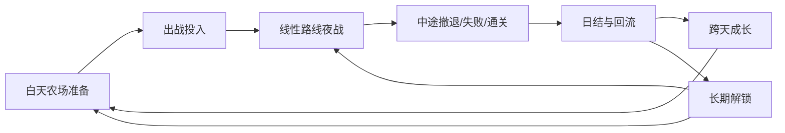
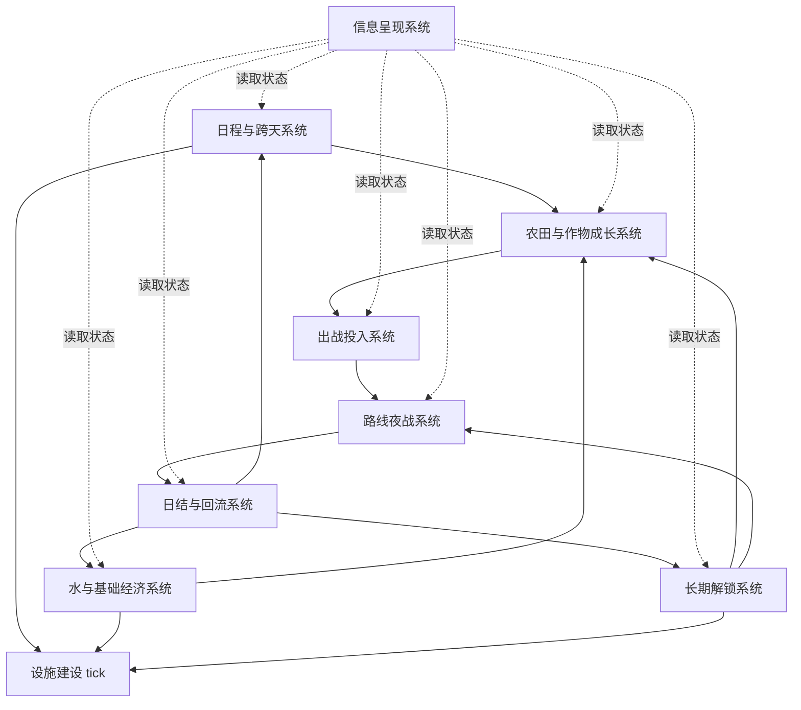
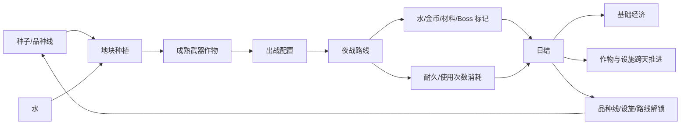

# 系统架构：刃种农庄

## 架构定位

本阶段确定“哪些系统支撑一轮玩法”，不展开单系统内部规则。

新版架构从旧的“威胁预告 -> 白天规划 -> 夜战验证”改为“白天农场准备 -> 出战投入 -> 线性路线夜战 -> 日结回流 -> 跨天成长”。这次调整的核心原因是：用户希望保留夜战随机性和未知感，不希望每天早上提前给出完整敌情、推荐标签和掉落答案。

因此，威胁预告不再是 P0 系统。信息呈现系统仍然存在，但职责是帮助玩家读懂农场、资源、路线经验和战后结果，而不是替玩家解题。

## 一句话架构

玩家每天在农庄里用有限地块、水和设施准备武器作物，晚上把成熟作物带入一条线性路线战斗，通过撤退、Boss 击败和日结回流把水、金币、材料、品种线和设施解锁带回下一天。

## 总体闭环

## P0 系统清单

| 系统 | 目的 | 输入 | 输出 | P0 原因 |
|---|---|---|---|---|
| 日程与跨天系统 | 控制一天制节奏，确保夜战后才推进下一天 | 当前日期、夜战结束、撤退、日结完成 | 次日开始、作物成长 tick、设施建造 tick | 没有它，Meowgenics 式“打完才过一天”的驱动力不成立 |
| 农田与作物成长系统 | 让玩家在真实地块中播种、浇水、成熟、收获武器作物 | 种子、地块、水、跨天 tick、设施效果 | 成熟作物、作物库存、成长状态 | 没有它，题材只剩战斗，不再是武器农场 |
| 水与基础经济系统 | 管理水、金币、基础材料等轻压力资源 | 夜战带回、日常消耗、建造消耗、奖励结算 | 可用水、金币、基础材料、短缺状态 | 水连接夜战深度和作物成长，必须独立可读 |
| 出战投入系统 | 把农场产物转化为本晚战斗配置和消耗记录 | 作物库存、弹药库存、出战栏限制 | 出战配置、出战消耗、耐久/使用次数扣减 | 没有它，白天生产和夜晚战斗断开 |
| 路线夜战系统 | 承载低输入战斗、小怪、普通 Boss、路线 Boss、撤退和失败 | 出战配置、线性路线进度、玩家操作 | 战斗结果、小怪资源、Boss 击败状态、撤退结果 | 这是晚上“带着作物去打怪”的主体验 |
| 日结与回流系统 | 把夜战收益、损耗和推进整理为下一天输入 | 战斗结果、掉落、消耗、撤退/失败状态 | 日结报告、资源入账、损耗回收、跨天交接 | 没有它，玩家不知道这一天赚了什么、亏了什么 |
| 长期解锁系统 | 解锁新品种线、设施和最终 Boss 条件 | 普通 Boss 结果、路线 Boss 结果、关键材料、通关标记 | 新种子、新品种线、设施、路线/最终 Boss 解锁状态 | 长期期待优先来自武器作物谱系和设施，而不是角色数值 |
| 信息呈现系统 | 让玩家看懂状态、压力、未知路线、日结和解锁 | 各系统状态 | 农场状态、资源压力、有限路线线索、日结反馈、解锁提示 | 不做预告答案表，但仍要让玩家能规划和复盘 |

## P1 / P2 边界

### P1：MVP 成立后优先扩展

| 能力 | 说明 |
|---|---|
| 多路线框架 | 长线结构保留，但当前先用线性路线验证闭环 |
| 路线生态差异 | 不同路线可以有怪物生态、材料和 Boss 差异 |
| 有限路线情报 | 可给少量方向性线索，但不能还原成每日威胁预告 |
| 品种线分支强化 | 长期成长第一优先级，用来制造“下一个抽象作物是什么”的期待 |
| 农田设施分支 | 长期成长第二优先级，支撑水、地块、成长速度、保鲜、加工 |
| 轻自动化与批量操作 | 用于降低中后期重复劳动 |

### P2：后期实验或内容扩展

| 能力 | 说明 |
|---|---|
| 农田入侵防守事件 | 可以测试同图种田打怪，但不作为 MVP 主结构 |
| 天气/灾害/特殊夜晚 | 会提高经营压力，必须谨慎 |
| 多路线节点地图 | 等路线生态和战斗内容稳定后再设计 |
| 多结局或最终 Boss 变体 | 依赖足够多的路线和品种线内容 |
| 复杂生产线排布 | 当前明确排除，不作为默认扩展方向 |

## 系统依赖

## 数据流

## 系统职责说明

### 1. 日程与跨天系统

负责一天制的节奏规则。玩家白天可以整理农场和出战配置，但不会因为现实时间流逝自然进入下一天。只有夜战结束、撤退、失败或通关后，经过日结，才触发下一天。

它不负责奖励结算，也不负责作物内部成长规则。它只负责“什么时候推进一天”以及“哪些系统收到跨天 tick”。

### 2. 农田与作物成长系统

负责地块、播种、浇水、成长、成熟、收获、多轮采收和作物库存。农田必须保留真实视觉和地块感，因为“武器是种出来的”是核心幻想。

它不负责夜战操作，也不直接决定 Boss 掉落。作物能如何战斗，进入系统设计阶段后由作物行为和出战投入共同定义。

### 3. 水与基础经济系统

负责水、金币、基础材料等通用资源。水是连接夜战和作物成长的关键资源：夜战走得越远，通常能带回更多水；水不足时作物停止生长，而不是频繁枯死。

金币主要服务设施建设，基础材料服务设施、强化、保鲜或品种线推进。它们不能重新把夜战拉回“卖货变现”的逻辑。

### 4. 出战投入系统

负责把成熟武器作物、弹药和消耗品变成夜晚出战配置。带出战就消耗耐久或使用次数，这让“今天带什么出去”成为真实投入，而不是无成本换装。

它不负责战斗过程，也不负责掉落。它只负责“玩家把什么带上路，以及这些东西承担什么投入成本”。

### 5. 路线夜战系统

负责低输入路线战斗：移动、站位、自动武器行为、一个出战前绑定的主动技、小怪、普通 Boss、路线 Boss、撤退、失败和通关结果。

MVP 采用线性路线，不做路线地图、节点选择或主动难度倍率。夜战可以持续二三十分钟，但玩家应能在中途撤退，把已获得的资源带回去。

### 6. 日结与回流系统

负责把夜战后的收益、损耗和推进解释清楚：带回了多少水、金币、材料；消耗了哪些武器作物耐久；哪些作物成长了；哪些设施完成了；是否获得 Boss 奖励或解锁条件。

日结是玩家判断“今天干得值不值”的核心反馈，不应该只是一张奖励列表。

### 7. 长期解锁系统

负责把 Boss 结果和关键资源转化为长期目标。优先级是武器作物品种线，其次是农田设施，再其次是角色数值。

普通 Boss 可以给较好的材料、种子线索或设施材料。路线 Boss 应承担更关键的品种线、设施或路线推进。最终 Boss 的解锁可以作为长期目标保留，但 MVP 不急着实现完整多路线结构。

### 8. 信息呈现系统

负责状态可读性，而不是提前泄题。它应该让玩家知道：哪些作物缺水、哪些明天会成熟、现在水够不够、出战会消耗什么、这条路线大概推进到哪里、日结带回了什么、刚解锁了什么。

它可以提供有限路线线索，但不能变成“今晚敌人、推荐标签、可能掉落”的完整威胁预告。

## 目录映射

| 目录 | 本阶段定位 |
|---|---|
| `03_systems/S01_core_gameplay/` | 日程跨天、农田地块、作物成长、浇水、水与基础经济、设施建设、出战前准备、出战投入接口 |
| `03_systems/S02_route_combat/` | 路线夜战、小怪、普通 Boss、路线 Boss、撤退、失败、战斗结果 |
| `03_systems/S03_meta_progression/` | 日结回流、掉落结算、Boss 奖励、品种线解锁、设施解锁、最终 Boss 解锁条件 |

## MVP 最小闭环

MVP 不追求多路线和完整终局，只验证以下闭环：

1. 玩家在白天播种、浇水、收获至少 3 类武器作物。
2. 玩家选择成熟作物组成出战配置，带出战即消耗耐久或使用次数。
3. 玩家晚上进入一条线性路线，打小怪、拿基础资源，并可中途撤退。
4. 玩家击败一个普通 Boss，获得比小怪更好的材料或种子线索。
5. 玩家击败一个路线 Boss，获得一个关键品种线或关键农田设施解锁。
6. 日结展示收益、损耗、作物成长、设施完成和解锁变化。
7. 进入下一天，农场状态发生变化，玩家自然想再打下一晚。

如果这条闭环不成立，不应继续增加多路线地图、农田入侵、复杂情报、生产线排布、社交或商业化系统。

## 风险与校验

| 风险 | 校验方式 |
|---|---|
| 农场变成菜单，没有真实经营感 | 玩家是否能在地块、浇水、成熟和收获中形成“这是我的农庄”的记忆 |
| 夜战变成独立幸存者玩法 | 每种出战武器作物是否能回溯到白天种植选择 |
| 水资源变得过重 | 水不足是否只是停止成长或延迟收益，而不是惩罚式毁档 |
| 线性路线过于单调 | MVP 后是否能自然扩展路线生态，而不是靠堆数值延长 |
| 去掉预告后白天规划失去目标 | 玩家是否能通过库存、作物成长、路线经验和有限线索做出可解释选择 |
| 多路线后置导致长期目标不足 | 路线 Boss 解锁品种线和设施是否足以支撑早期长期期待 |
