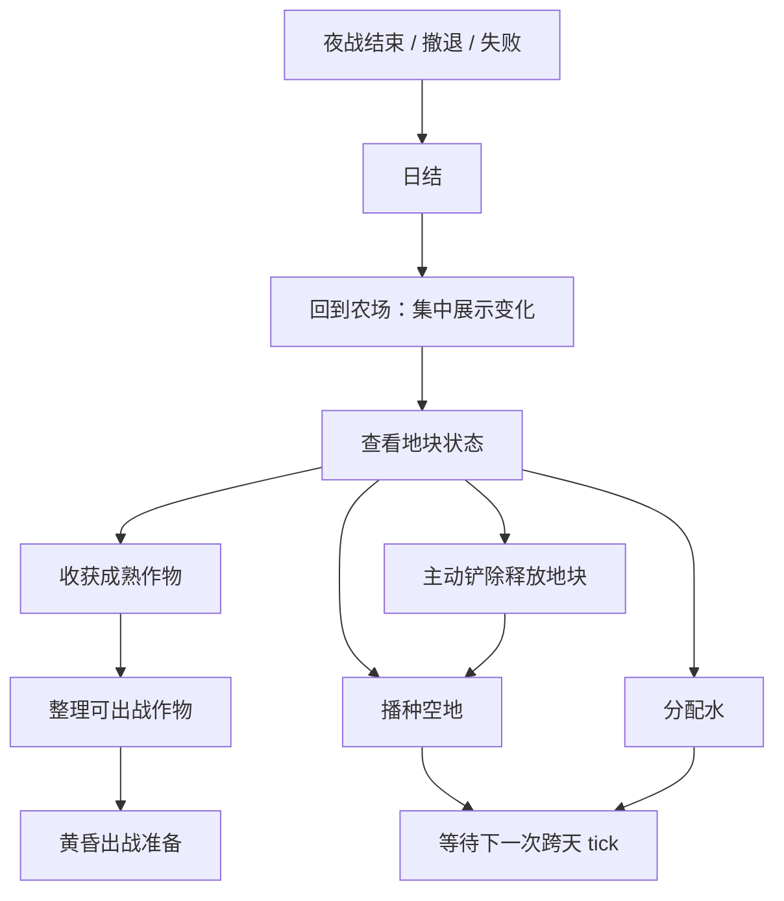

# 核心玩法系统：日间农场

## 设计目的

Day Farm 的目的不是让玩家经营一座高效率农场，而是让玩家用少量关键操作为下一次路线夜战做投入。

它要提供三种体验：

1. 我真的在一块块地里种武器作物。
2. 我每天只做少数有意义的取舍，而不是处理杂活。
3. 我打完一晚回来，农庄发生了能看见的变化。

## 系统范围

Day Farm 负责：

- 日程与跨天 tick。
- 地块、播种、浇水、成长、停止生长、成熟、收获。
- 主动铲除作物。
- 水在农田侧的使用。
- 农田设施入口：早期容错设施为堆肥箱、苗床；后续解锁项为简易灌溉沟、磨刃棚。
- 战后回到农场时的变化反馈。
- 输出作物状态给出战投入系统。

Day Farm 不负责：

- 武器作物的具体攻击方式、伤害、弹道、收割技。
- 夜战路线、敌人、普通 Boss、路线 Boss。
- Boss 奖励、品种线解锁、最终 Boss 解锁。
- 具体数值、作物内容表、UI 布局。

## 核心循环

## 白天关键操作

Day Farm 的 P0 操作只保留五类。

| 操作 | 玩家在做什么 | 设计价值 | 边界 |
|---|---|---|---|
| 选地块 | 选择要查看或操作的地块 | 保留真实农田感 | 不做复杂地块属性 |
| 选种子 | 在空地上种下已拥有种子 | 决定未来几天的出战可能性 | 不在本系统定义战斗行为 |
| 分配水 | 决定哪些作物今天推进成长 | 制造轻压力和取舍 | 不做高压饥荒 |
| 收获 | 拿走成熟作物，进入作物库存 | 把农场产出转为出战准备 | 收获后的战力转化后置 |
| 主动铲除 | 移除不想保留的作物，释放地块 | 解决有限地块卡住问题 | 只获得空地，不返还资源 |

不进入 P0 的操作：

- 除草、驱虫、修剪等日常杂活。
- 复杂加工、装弹、嫁接、变异。
- 自动浇水和批量托管。
- 生产线排布。

## 地块状态

每块地至少有以下状态：

| 状态 | 含义 | 玩家可做 |
|---|---|---|
| 空地 | 当前没有作物 | 播种 |
| 已播种 | 作物已种下，但还未进入可收获状态 | 浇水、查看详情、主动铲除 |
| 成长中 | 已获得今日成长推进 | 查看详情、等待跨天 |
| 停止生长 | 因缺水或条件不足，当天不推进成熟 | 浇水、主动铲除 |
| 成熟可收获 | 可收获为武器作物或弹药 | 收获、查看详情 |
| 多轮采收后等待 | 可多次采收的作物，下一轮尚未成熟 | 浇水、查看详情、主动铲除 |

地块状态要能被玩家视觉辨认，但成熟天数不常驻压屏。玩家点开地块时可以看到详情。

## 作物状态

Day Farm 只记录作物的农场侧状态。

| 字段 | 用途 |
|---|---|
| 作物品种 | 标记它属于哪条武器作物品种线 |
| 成长阶段 | 用于展示幼苗、成长期、成熟等视觉 |
| 距离成熟天数 | 点开详情时显示 |
| 是否可收获 | 决定是否能进入作物库存 |
| 是否可出战 | 输出给出战投入系统 |
| 是否多轮采收 | 决定收获后是否保留在地块 |
| 今日是否已浇水 | 决定跨天时是否推进成长 |
| 今日是否停止生长 | 用于回访反馈 |
| 是否经过磨刃棚处理 | 作为出战前处理标记，具体战斗效果后置 |

本系统不定义：

- 攻击范围。
- 攻击频率。
- 伤害。
- 弹药量。
- 战斗标签效果。
- 收割技具体效果。

## 水规则

水是轻压力资源，不是生存饥荒资源。

规则边界：

1. 水没有储量上限，因此首批设施不做水缸。
2. 作物需要水才能在跨天 tick 中推进成长。
3. 水不足时，未浇水作物停止生长。
4. 停止生长不等于枯萎、死亡或毁档。
5. 玩家可以选择不浇某些作物，把水给更重要的作物。
6. 自动浇水和强批量操作后置。

水的设计目的不是惩罚玩家，而是让玩家每天问自己：今晚回来这些水够不够支撑我最想要的作物成熟？

## 主动铲除

主动铲除是释放地块的手段，不是资源回收手段。

规则：

1. 玩家可以铲除任意未锁定作物。
2. 铲除后地块变为空地。
3. 铲除不返还堆肥、材料、种核、金币或水。
4. 铲除按钮必须明确表达“只释放地块”。
5. 铲除用于修正种植计划，不用于刷资源。

设计理由：

有限地块会制造取舍，但不能把玩家卡死。只返还空地能让决策干净：你铲掉它，是因为你更需要这块地，而不是因为你想套利。

## 战后回访变化

夜战结束并完成日结后，玩家回到农场时应集中看到变化。

回访变化包括：

| 变化 | 反馈目的 |
|---|---|
| 作物成长推进 | 告诉玩家夜战推动了下一天 |
| 作物成熟 | 形成“回来有东西收”的期待 |
| 停止生长 | 解释水不足造成的延迟 |
| 多轮采收刷新 | 让可持续作物有节奏感 |
| 设施完成 | 强化长期投资 |
| 堆肥箱产出 | 让损耗有回收感 |

反馈方式原则：

- 回访时集中展示，不在平时常驻打扰。
- 先展示重要变化，再展示普通成长。
- 成熟和设施完成应比普通成长更显眼。
- 停止生长是清晰提示，不是惩罚表现。

## 设施入口

Day Farm 的设施分为早期容错设施和后续解锁设施。

| 设施 | 定位 | 当前优先级 |
|---|---|---|
| 堆肥箱 | 把损耗部分转成回收感 | P0 早期容错 |
| 苗床 | 缓解正式地块占用压力 | P0 早期容错 |
| 简易灌溉沟 | 降低局部浇水成本或操作负担 | P1 解锁项 |
| 磨刃棚 | 提供作物武器化的出战前处理入口 | P1 解锁项 |

### 堆肥箱

用途：把战斗损耗、过期废弃或日结损耗转成少量肥料。

设计边界：

- 处理“已经发生的损耗”，不处理主动铲除。
- 不能让玩家通过乱种乱铲刷资源。
- 反馈应出现在日结或回访变化中。

它解决的问题：让失败和消耗不完全变成心理损失，同时保持主动铲除的干净边界。

### 苗床

用途：让部分种子进行早期准备，降低正式地块占用压力。

设计边界：

- 苗床是轻节奏设施，不是复杂育苗生产线。
- 它可以让玩家提前准备作物，但不能完全替代正式地块成长。
- 它不定义作物战斗能力。

它解决的问题：玩家想准备未来几天的作物，但正式地块有限。

### 简易灌溉沟

用途：降低少量相邻地块的浇水成本或操作负担。

设计边界：

- 它是后续解锁项，不是早期初始能力。
- 它不是自动浇水。
- 它只改善局部地块，仍然要求玩家做水分配判断。
- 它不应引导复杂排布优化。

它解决的问题：在玩家理解手动浇水后，提供后续设施价值，但不跳过水资源决策。

### 磨刃棚

用途：对成熟武器作物进行出战前轻处理，让作物更像“被拿去打怪的武器”。

设计边界：

- 它是后续解锁项，不是早期初始能力。
- Day Farm 只记录“是否经过磨刃棚处理”。
- 具体战斗效果由出战投入系统或路线战斗系统定义。
- 磨刃棚不能变成复杂加工链。

它解决的问题：在不越界定义战斗行为的前提下，给“武器化农作物”一个农场侧触点。

## 出战状态输出

Day Farm 向后续系统输出的是作物状态，而不是战斗规则。

输出给出战投入系统：

| 输出 | 含义 |
|---|---|
| 作物品种 | 用于识别品种线 |
| 可出战状态 | 是否能进入出战配置 |
| 成熟状态 | 是否已经收获或可收获 |
| 多轮采收状态 | 是否仍占用地块 |
| 耐久/使用次数入口 | 只提供状态字段，具体消耗由出战投入系统定义 |
| 磨刃棚处理标记 | 后续系统可读取并定义效果 |

## 信息呈现原则

Day Farm 的信息要“可查、回访爆发、不常驻压屏”。

| 信息 | 呈现方式 |
|---|---|
| 地块当前状态 | 直接通过地块视觉表达 |
| 距离成熟天数 | 点开地块详情显示 |
| 今日是否已浇水 | 地块视觉或详情显示 |
| 停止生长原因 | 回访变化和地块详情显示 |
| 成熟可收获 | 回访变化重点提示，地块视觉明显 |
| 设施完成 | 回访变化重点提示 |

## P0 最小闭环

Day Farm 的最小闭环如下：

1. 玩家夜战后回到农场。
2. 系统展示作物成长、成熟、停止生长和设施完成。
3. 玩家收获成熟武器作物。
4. 玩家在空地上播种。
5. 玩家把水分配给想推进的作物。
6. 玩家铲除不想保留的作物，只获得空地。
7. 玩家整理可出战作物，进入黄昏准备。
8. 夜战结束后，跨天 tick 再次推动农场变化。

## P1 / P2 后置

| 优先级 | 内容 | 后置原因 |
|---|---|---|
| P1 | 扩地 | 需要先验证有限地块取舍是否成立 |
| P1 | 简易灌溉沟 | 需要先让玩家理解手动浇水的价值 |
| P1 | 磨刃棚 | 需要出战投入或作物行为更清楚后再定义效果 |
| P1 | 自动浇水 | 早期会削弱水分配判断 |
| P1 | 嫁接架 | 需要品种线和战斗行为更清楚后再做 |
| P1 | 保鲜设施 | 需要先验证消耗和囤积压力 |
| P1 | 批量操作 | 中后期减负，不是早期核心 |
| P2 | 农田入侵 | 会把农场和战斗同屏压力推高 |
| P2 | 天气灾害 | 容易把水压力做重 |
| P2 | 复杂地块属性 | 会推向生产线优化 |
| P2 | 离线成长 | 与“不战斗不进下一天”冲突 |

## 验证标准

| 目标 | 验证问题 |
|---|---|
| 少量关键操作成立 | 玩家是否能在短时间内完成白天段，并说出每一步为什么做 |
| 水是轻压力 | 玩家是否会思考水分配，但不会因为缺水觉得被惩罚 |
| 回访变化成立 | 玩家夜战后是否期待回农场看成熟和设施完成 |
| 铲除边界清楚 | 玩家是否理解铲除只释放地块，不能刷资源 |
| 设施价值清楚 | 堆肥箱、苗床是否能提供早期容错；简易灌溉沟、磨刃棚是否适合作为后续解锁 |
| 系统边界清楚 | 玩家和设计文档是否不会把 Day Farm 当作战斗行为系统 |
