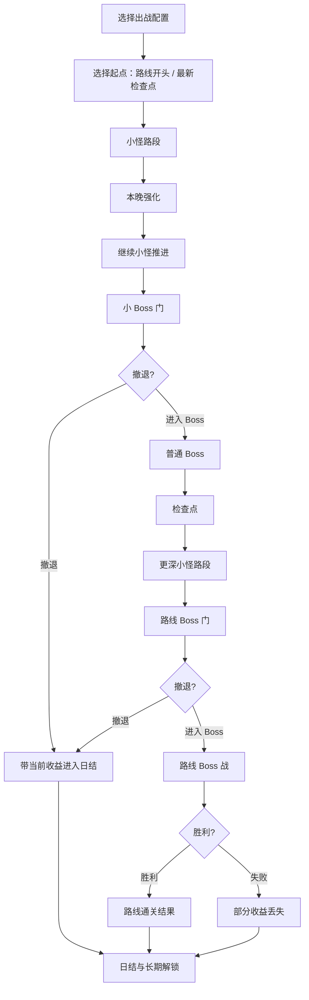

# 路线战斗系统

## 设计目的

Route Combat 的目的不是做一套独立动作游戏，而是验证玩家白天准备的武器作物组合。

它要提供三种体验：

1. 我带来的武器作物正在自动发挥价值。
2. 我在固定撤退点判断“继续推进还是带收益回农庄”。
3. 我每次推过 Boss 和检查点，都离路线终点更近。

## 系统范围

Route Combat 负责：

- 线性路线的抽象路段战斗。
- 路线进度图、路段、检查点、普通 Boss、路线 Boss。
- 玩家战斗输入：移动、站位、一个主动技键。
- 武器作物在夜战中的行为承接：持有型作物、场上自主作物、主动技触发和协同表现。
- 小怪路段的资源产出和战斗考题教学。
- 固定撤退点、Boss 门、失败、通关。
- 本晚内永久强化。
- 战斗结果输出给日结与长期解锁系统。

Route Combat 不负责：

- Boss 掉落、品种线解锁、设施解锁。
- 多路线地图、节点选择、路线生态差异。
- 作物具体成长规则、农田跨天、日结报告。
- 具体数值、敌人表、Boss 技能表、UI 布局。

## 核心结构

## 路线进度结构

MVP 使用一条线性路线。路线内部不是完整地图探索，而是抽象战斗段。

| 结构元素 | 作用 | 规则边界 |
|---|---|---|
| 路线进度图 | 展示当前位置、Boss、检查点和终点 | 不是多路线节点地图 |
| 小怪路段 | 提供基础资源、战斗考题和本晚强化机会 | 不只是刷怪填充 |
| 小怪推进段 | 普通 Boss 前的连续小怪压力和本晚强化段落 | 段末不能撤退，避免变成随时止损 |
| 小 Boss 门 | 普通 Boss 前的首次撤退点 | 进入 Boss 后不能撤退 |
| 普通 Boss | 固定深度的阶段检查 | 不等于路线通关 |
| 检查点 | 通过关键节点后可从这里继续 | 从检查点开始会跳过前段收益 |
| 路线 Boss 门 | 进入路线 Boss 前的最后撤退点 | 进入 Boss 后不能撤退 |
| 路线 Boss | 路线终点战斗 | 输出路线 Boss 击败状态，不直接发放成长奖励 |

## 起点选择

夜战开始时，玩家可以选择：

| 起点 | 体验 | 代价 |
|---|---|---|
| 从路线开头开始 | 刷更多小怪资源、获得更多本晚强化机会 | 推进到深处需要更久 |
| 从最新检查点开始 | 更快挑战深处路段或 Boss | 跳过前段未打收益 |

这个选择的价值是让玩家根据当天农场状态做判断：

- 缺水、金币、基础材料时，从头开始更合理。
- 想冲普通 Boss、路线 Boss 或新检查点时，从检查点开始更合理。

## 战斗输入

Route Combat 的输入要轻。

P0 输入：

1. 移动。
2. 一个主动技键。
3. 撤退点处的继续/撤退选择。

不做：

- 闪避。
- 翻滚。
- 格挡。
- 多技能栏。
- 复杂 CD 管理。
- 主动选择难度倍率。

### 移动

移动用于：

- 调整与敌人的距离。
- 躲开冲刺敌人路线。
- 绕开慢速弹道。
- 让自动武器作物进入合适的发挥位置。
- 拾取或接触战斗中掉落的基础资源。

移动不是高精度动作操作。敌人速度、弹道和碰撞压力都必须适配“无闪避”的前提。

### 主动技绑定

出战前，玩家从可主动的武器作物中选择一个主动技绑定到统一按键。

规则边界：

1. 战斗中只有一个主动技键。
2. 大部分武器作物仍然自动发挥。
3. 主动技提供关键时机选择，而不是多技能循环。
4. 主动技的具体效果由出战投入或武器作物系统定义，本系统只负责触发窗口和战斗场景承接。

主动技的核心手感是积攒和爆发，而不是普通冷却循环。过载、收割爆发、特殊命令、消耗新鲜度都可以出现，但都必须服务“攒起来，再爆出来”的节奏。

## 武器作物行为承接

本节定义路线战斗需要承接的武器作物行为；不再维护独立的武器行为子文档。

P0 允许两类装备槽作物：

| 类型 | 战斗表现 | 边界 |
|---|---|---|
| 持有型武器作物 | 围绕玩家距离、朝向、范围、自动挥击或自动发射发挥 | 不做重动作瞄准和连招 |
| 场上自主作物 | 在战场上自动索敌、拦截、牵制、输出或巡游 | 不做复杂召唤物管理 |

玩家大多数时间通过躲敌人、保持距离和调整站位影响作物发挥；少部分作物或协同可以鼓励拉怪，但不能变成高精度引怪或塔防摆位。

武器作物差异来自三层：

1. 它解决的战斗问题。
2. 它的行为方式。
3. 它的数值轮廓，如近战/远程、攻速、伤害、发射数量、射程、暴击、索敌方式等。

作物协同优先做具体作物对具体作物。组合应制造“差一个就成了”和“终于成了”的情绪，但每个组件单独使用也必须有价值。

## 小怪路段

小怪路段承担两类职责：

1. 产出基础资源：水、金币、基础材料。
2. 教玩家理解战斗考题。

小怪不是纯难度填充。每类小怪都应该驱动玩家学习某个操作或配置判断。P0 小怪优先做行为考题：通过前摇、弹道、护壳、分裂、区域限制和路段组合，让玩家理解自己缺的是群攻、单点突破、爆发、控场、保命还是远程覆盖。

| 小怪类型方向 | 驱动玩家学习 | 可读性要求 |
|---|---|---|
| 冲刺敌人 | 横向移动、距离判断、站位调整 | 明显前摇，冲刺路线可读 |
| 远程敌人 | 观察弹道、保持移动 | 弹道速度不能过快 |
| 护甲敌人 | 理解破甲、穿透或钝击价值 | 护甲状态要明显 |
| 群聚敌人 | 理解清群和范围武器价值 | 数量压力渐进 |
| 高威胁慢敌 | 理解优先级和拉扯 | 速度慢但威胁清楚 |

这些只是敌人职责方向，不是完整内容表。具体敌人可以在本文件内按需继续细化；当前不做“某个敌人对应某个指定作物”的一对一答案，敌人只考能力层。

## 普通 Boss

普通 Boss 是路线固定深度的阶段小终点。

设计职责：

- 检查玩家当前出战组合是否有基本适应性。
- 提供比小怪更强的战斗记忆点。
- 形成检查点或关键路段门槛。

普通 Boss 不负责：

- 路线通关。
- 发放具体品种线或设施解锁。
- 强制玩家携带指定武器。

普通 Boss 可以比小怪更机制化，但不应复杂到路线 Boss 的层级。P0 普通 Boss 只考 2-3 个能力，让失败后复盘能落到“下次补群攻/单点突破/爆发或保命”。

## 路线 Boss

路线 Boss 是一条线性路线的终点战斗。

设计职责：

- 作为约 10 天准备后首次触达的大目标。
- 测试玩家对路线敌人生态和武器作物组合的理解。
- 输出路线 Boss 击败状态给长期解锁系统。

规则边界：

1. 进入路线 Boss 后不能撤退。
2. 路线 Boss 不能强制指定某个武器作物。
3. 路线 Boss 可以偏向测试某些能力，如清群、破甲、保命、远程、控场、爆发。
4. 高级 Boss 的机制复杂度和强度都应高于普通 Boss。
5. 单一路线一晚最多 3 个 Boss，避免变成 Boss Rush。

## 撤退规则

撤退只能发生在固定撤退点。

允许撤退的位置：

- 普通 Boss 前的小 Boss 门。
- 路线 Boss 门前。

不允许撤退的位置：

- 小怪路段战斗中。
- 小怪路段结束后。
- 普通 Boss 战中。
- 路线 Boss 战中。

撤退结果：

- 保留当前已经获得的收益。
- 进入日结。
- 出战作物仍然消耗，因为带出战即消耗。
- 不触发未击败 Boss 的通关或关键进度。

设计理由：

固定撤退点把夜战变成阶段性下注。玩家必须先撑过若干小怪推进段，至少抵达小 Boss 门，才获得第一次回本选择权；如果每个小怪段后都能撤退，路线压力会被削平。

## 失败规则

死亡失败时：

1. 夜战结束。
2. 本晚收益丢失一部分。
3. 剩余收益进入日结。
4. 出战作物仍然消耗。
5. Boss 未击败则不记录 Boss 结果。
6. 收益保留比例可由后续局外成长改善。

失败不能全丢。全丢会把本项目推向硬核搜打撤，破坏轻压力基调。

## 本晚内永久强化

Route Combat 允许本晚内永久强化。

定义：

- 在本次夜战中获得。
- 获得后持续到本晚结束。
- 不直接成为局外永久成长。
- 不只持续一个路段。

可能来源：

- 路段结束奖励。
- 普通 Boss 后奖励。
- 特殊小怪事件。
- 检查点奖励。

强化方向可以包括：

| 强化方向 | 作用 |
|---|---|
| 武器作物表现强化 | 让某类作物本晚更好发挥 |
| 主动技充能强化 | 让绑定主动技更可靠 |
| 生存容错强化 | 降低本晚失败概率 |
| 资源收益强化 | 改变本晚水、金币、材料获取效率 |
| 推进强化 | 帮助冲击更深路段或 Boss |

具体强化池不在本文件展开，后续进入执行文档或内容表。

## 资源与结果输出

Route Combat 输出结果，不直接处理日结展示或长期解锁。

输出给日结系统：

| 输出 | 含义 |
|---|---|
| 撤退/失败/通关状态 | 决定日结类型 |
| 小怪资源 | 水、金币、基础材料等基础收益 |
| 本晚强化记录 | 用于解释本晚过程，不进入局外永久成长 |
| 出战作物消耗状态 | 用于日结损耗展示 |
| 死亡收益保留/丢失状态 | 用于失败结算 |
| 检查点推进 | 用于更新可选起点 |

输出给长期解锁系统：

| 输出 | 含义 |
|---|---|
| 普通 Boss 击败状态 | 作为阶段性结果 |
| 路线 Boss 击败状态 | 作为关键长期推进 |
| 路线通关状态 | 用于后续最终 Boss 或多路线结构 |

## P0 最小闭环

Route Combat 的最小闭环如下：

1. 玩家带着出战作物进入路线。
2. 玩家选择从路线开头或最新检查点开始。
3. 玩家进入小怪路段，靠移动、站位、自动武器作物和一个主动技键战斗。
4. 小怪掉落基础资源，并通过可读行为提出战斗考题。
5. 小怪段结束获得本晚强化，但不能撤退。
6. 玩家至少推进到普通 Boss 前的小 Boss 门，才选择撤退或进入。
7. 玩家击败普通 Boss 后形成阶段结果和检查点。
8. 路线 Boss 与更深路线保留为后续执行层扩展。
9. 胜利、失败或撤退结果输出给日结与长期解锁系统。

## P1 / P2 后置

| 优先级 | 内容 | 后置原因 |
|---|---|---|
| P1 | 更多普通 Boss | 先验证一个普通 Boss 是否能承担阶段检查 |
| P1 | 路线生态差异 | 需要敌人、作物和掉落系统更成熟 |
| P1 | 更多本晚强化池 | 先验证强化节奏，不急着扩内容 |
| P1 | 有限路线情报 | 可增强规划，但不能变回威胁预告 |
| P2 | 多路线节点地图 | 属于后续多路线结构 |
| P2 | 农田入侵 | 会改变战斗空间和农场压力 |
| P2 | Boss Rush | 容易脱离农场投入和路线回本 |
| P2 | 真实地图探索 | 会推高体量和导航复杂度 |

## 验证标准

| 目标 | 验证问题 |
|---|---|
| 低输入成立 | 玩家是否只依靠移动和一个主动技键就能理解战斗 |
| 武器作物主角成立 | 玩家是否主要复盘“我带的作物发挥如何” |
| 固定撤退点成立 | 玩家是否在小 Boss 门和后续 Boss 门前认真判断去留 |
| 检查点选择成立 | 玩家是否理解从头刷资源和从检查点推深度的差异 |
| 小怪教学成立 | 玩家是否能从敌人前摇、弹道、护甲中学到应对 |
| Boss 节点成立 | 玩家是否感到 Boss 战有重量，但不是强制指定武器的钥匙检查 |
| 失败压力成立 | 死亡部分收益丢失是否让玩家紧张，但不至于不敢尝试 |
