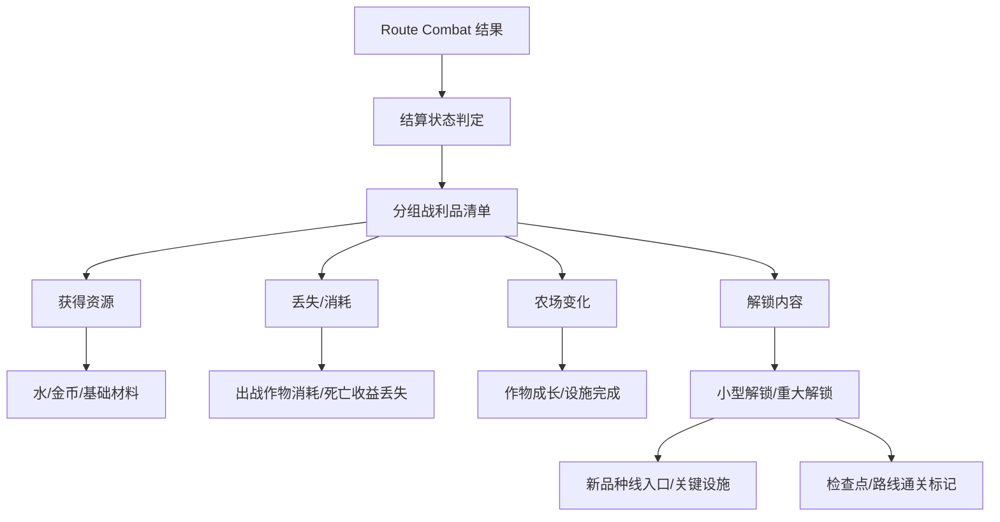

# 长期成长系统

## 设计目的

Meta Progression 的目的不是简单发奖励，而是让玩家理解：这一晚如何改变下一天、下一次路线推进和长期解锁。

它要提供三种体验：

1. 我清楚知道这一晚赚了什么、亏了什么。
2. 我知道 Boss 为什么值得打。
3. 我期待下一个新品种线入口或关键设施。

## 系统范围

Meta Progression 负责：

- 分组战利品清单。
- 撤退、死亡、通关的结算差异。
- 小怪、普通 Boss、路线 Boss 的奖励层级。
- 死亡部分收益丢失。
- 路线 Boss 首杀重大解锁保护。
- 新品种线入口、关键设施、小型解锁、局外数值成长的槽位。
- 检查点、路线通关和未来最终 Boss 框架记录。

Meta Progression 不负责：

- Boss 战斗过程和敌人行为。
- 作物具体战斗行为。
- 农田播种、浇水、成长规则。
- 堆肥箱具体转化规则。
- 具体掉落率、资源数量、UI 布局。

## 核心结构

## 日结分组

日结主表现是战利品清单，但必须分组。

| 分组 | 内容 | 目的 |
|---|---|---|
| 路线结果 | 撤退、死亡、普通 Boss 击败、路线 Boss 击败、检查点推进、路线通关 | 先告诉玩家这一晚的性质 |
| 获得资源 | 水、金币、基础材料、普通 Boss 推进材料、小型解锁 | 告诉玩家赚了什么 |
| 丢失/消耗 | 出战作物消耗、死亡收益丢失、跳过前段收益 | 告诉玩家付出了什么 |
| 农场变化 | 作物成长、停止生长、成熟、设施完成、堆肥箱入口 | 告诉玩家农庄变了什么 |
| 解锁内容 | 新品种线入口、关键设施、检查点、路线通关标记 | 告诉玩家长期推进了什么 |

顺序建议：

1. 路线结果。
2. 获得资源。
3. 丢失/消耗。
4. 农场变化。
5. 解锁内容。

这样玩家先知道“这一晚是什么结果”，再看“赚了多少”，最后看到“为什么还想继续”。

## 结算状态

### 撤退结算

触发：玩家在固定撤退点选择撤退。

结算规则：

- 保留当前已获得收益。
- 出战作物仍然消耗。
- 未击败的 Boss 不记录结果。
- 未触达的检查点不更新。
- 日结语气是“带收益回家”，不是失败。

设计目的：让撤退成为回本判断。

### 死亡结算

触发：玩家在路段或 Boss 战中死亡。

结算规则：

- 本晚各类收益都可能部分丢失。
- 剩余收益进入日结。
- 出战作物仍然消耗。
- 未击败 Boss 不记录结果。
- 已触发的路线 Boss 首杀重大解锁受保护。
- 收益保留比例可由后续局外成长改善。

设计目的：让死亡有代价，但不是硬核全丢。

### 通关结算

触发：玩家击败路线 Boss。

结算规则：

- 记录路线 Boss 击败状态。
- 首杀时必定给重大解锁。
- 重大解锁受保护。
- 进入日结后展示路线通关或路线推进。
- 具体开启下一路线、最终 Boss 或回农庄消化奖励，暂不在 MVP 定死。

设计目的：让路线 Boss 成为长期推进节点。

## 奖励层级

### 小怪奖励

小怪奖励是基础回流。

主要内容：

- 水。
- 金币。
- 基础材料。

用途：

- 水回到农田成长。
- 金币服务设施建设。
- 基础材料服务设施、堆肥、磨刃、后续强化或执行文档中的具体消耗。

边界：

- 小怪不承担重大解锁。
- 小怪可以提供本晚强化机会，但不直接替代 Boss 奖励。

### 普通 Boss 奖励

普通 Boss 是阶段推进奖励。

主要内容：

- 稳定推进材料。
- 稀有材料。
- 种子线索。
- 设施部件。
- 偶尔给小型解锁。

小型解锁可以是：

- 新种子线索。
- 轻量设施部件。
- 本路线相关强化项。
- 新出战配置入口。

边界：

- 普通 Boss 不等于路线通关。
- 普通 Boss 不应每次都给重大解锁。
- 普通 Boss 不能只掉更多金币。

### 路线 Boss 奖励

路线 Boss 是重大成长奖励。

首杀必给重大解锁，槽位为：

| 重大解锁槽位 | 含义 | 当前边界 |
|---|---|---|
| 新品种线入口 | 新的武器作物家族、变体方向或战斗风格入口 | 不在本系统定义具体作物 |
| 关键设施 | 能明显改变农田、出战准备或回流节奏的设施入口 | 不在本系统定义具体设施规则 |

路线 Boss 还可以记录：

- 路线通关标记。
- 最终 Boss 解锁进度。
- 后续多路线入口条件。

边界：

- 路线 Boss 首杀不能只给基础资源。
- 路线 Boss 首杀重大解锁不能被死亡收益丢失剥夺。
- 具体奖励内容后续进入品种线、设施或执行文档。

## 首杀保护

首杀保护只保护路线 Boss 的重大解锁。

规则：

1. 玩家击败路线 Boss 后，首杀重大解锁立即记录。
2. 如果之后死亡，死亡可以扣除部分资源和普通收益。
3. 死亡不能撤销首杀重大解锁。
4. 日结中必须明确显示“首杀解锁已保留”。

设计理由：

路线 Boss 是约 10 天准备后的大目标。如果玩家打赢 Boss 后因为后续死亡失去首杀奖励，挫败感会过强，且会削弱继续推进的意愿。

## 死亡收益丢失

死亡丢失不是全丢，而是部分丢失。

可受影响的收益类型：

| 收益类型 | 是否可能丢失 | 说明 |
|---|---|---|
| 小怪基础资源 | 是 | 水、金币、基础材料都可部分丢失 |
| 普通 Boss 推进材料 | 是 | 可部分丢失，具体比例后续定 |
| 普通 Boss 小型解锁 | 可配置 | 小型解锁是否保护后续再定 |
| 本晚强化记录 | 否 | 本晚已结束，只作为过程记录 |
| 路线 Boss 首杀重大解锁 | 否 | 必须保护 |
| 检查点推进 | 可配置 | 是否保护取决于检查点触发时机，后续执行文档定 |

收益保留比例可以被后续局外成长改善，例如：

- 死亡后保留更多水/金币/材料。
- 减少普通 Boss 奖励丢失。
- 提高出战损耗回收效率。

这些成长可以和初始生命、主动技充能效率等少量角色/局外数值成长并存，但不能成为长期主轴。

## 长期成长槽位

Meta Progression 只定义槽位，不定义具体内容。

| 槽位 | 优先级 | 来源 | 作用 |
|---|---|---|---|
| 新品种线入口 | 最高 | 路线 Boss 首杀、少量关键事件 | 打开新武器作物家族或变体方向 |
| 关键设施 | 高 | 路线 Boss 首杀、重要材料组合 | 改变农田、出战准备或回流节奏 |
| 小型解锁 | 中 | 普通 Boss 偶发、阶段目标 | 提供阶段惊喜和短期目标 |
| 局外数值成长 | 低 | 材料投资、后续系统 | 改善容错，如死亡收益保留、初始生命、主动技充能效率 |
| 最终 Boss 解锁框架 | 后置 | 多路线通关或路线 Boss 标记 | 保留长线目标 |

### 新品种线入口

定义：新的武器作物家族、变体方向或战斗风格入口。

当前不定义：

- 具体作物名字。
- 具体攻击方式。
- 具体标签。
- 具体成长天数。

### 关键设施

定义：能明显改变农田、出战准备或回流节奏的设施入口。

当前不定义：

- 设施具体等级。
- 数值效率。
- 具体消耗。
- 建筑 UI。

## 路线进度记录

Meta Progression 需要记录以下长期状态：

| 状态 | 用途 |
|---|---|
| 最新检查点 | 夜战开始时可选择从检查点继续 |
| 普通 Boss 击败记录 | 用于阶段推进、奖励记录和可能的小型解锁 |
| 路线 Boss 击败记录 | 用于重大解锁和路线通关 |
| 路线通关标记 | 用于后续多路线或最终 Boss 框架 |
| 最终 Boss 解锁进度 | P1/P2 框架，MVP 不展开具体规则 |

路线 Boss 通关标记应永久记录。玩家不需要重复证明同一个路线 Boss。

## P0 最小闭环

Meta Progression 的最小闭环如下：

1. 接收 Route Combat 的撤退、死亡或通关结果。
2. 生成分组战利品清单。
3. 结算小怪基础资源。
4. 结算出战作物消耗和死亡部分收益丢失。
5. 展示农场变化入口：作物成长、设施完成、堆肥箱入口。
6. 结算普通 Boss 稳定推进奖励，偶尔给小型解锁。
7. 结算路线 Boss 首杀重大解锁，并保护该解锁。
8. 更新检查点、路线 Boss 击败和路线通关标记。
9. 把结果交给下一天的农田和出战准备。

## P1 / P2 后置

| 优先级 | 内容 | 后置原因 |
|---|---|---|
| P1 | 多路线入口 | 第一条路线通关后续方向还未定死 |
| P1 | 更多新品种线入口类型 | 需要武器作物系统展开 |
| P1 | 关键设施分支 | 需要设施系统展开 |
| P1 | 收益保留成长线 | 需要失败压力验证后再细化 |
| P2 | 最终 Boss 完整解锁条件 | 依赖多路线结构 |
| P2 | 复杂研究系统 | 容易拖慢回流节奏 |
| P2 | 声望/世界状态 | 容易回到旧卖货评价逻辑 |
| P2 | 自动化成长树 | 容易压过品种线期待 |

## 验证标准

| 目标 | 验证问题 |
|---|---|
| 战利品清单可读 | 玩家是否能快速看懂获得、丢失、农场变化和解锁 |
| 死亡压力合适 | 玩家是否觉得死亡有代价，但不会觉得一晚白打 |
| 首杀保护成立 | 玩家是否明确知道路线 Boss 首杀重大解锁不会丢 |
| 普通 Boss 有价值 | 玩家是否期待普通 Boss，而不是只刷小怪或只冲路线 Boss |
| 长期槽位清楚 | 玩家是否知道新品种线入口和关键设施比角色数值更重要 |
| 边界清楚 | 文档是否没有过早定义具体作物、具体设施和掉落率 |
